# Bootstrap style
This style was created using [Bootstrap](https://getbootstrap.com/) version 5.1.3.

#### Import
If you imported go-editorjs-parser into your project, use the code below:
```golang
err = html.Bootstrap("YOUR/EDITORJS/OUTPUT/FILE.json", "YOUR/OUTPUT/FILE.html")
if err != nil {
    log.Fatal(err)
    return
}
```

#### Build
If you downloaded and build the project, execute with the command:
```shell
./goEditorjsParser -j Input.json -s bootstrap -o output/ -t html
```

#### Configuration
Pre-configured JSON file for bootstrap style:
```json
{
  "styleName": "bootstrap",
  "libraryPaths": [
    "https://cdn.jsdelivr.net/npm/bootstrap@5.1.3/dist/css/bootstrap.min.css"
  ],
  "pageHead": [
    "<meta charset=\"utf-8\">",
    "<meta name=\"viewport\" content=\"width=device-width, initial-scale=1\">"
  ],
  "spaceBetweenBlocks": "col-md-3 col-sm-3 col-xs-3",
  "alignment": {
    "left": "text-start",
    "center": "text-center",
    "right": "text-end"
  },
  "blocks": {
    "header": {
      "h1": "",
      "h2": "",
      "h3": "",
      "h4": "",
      "h5": "",
      "h6": ""
    },
    "paragraph": "",
    "quote": {
      "figure": "",
      "blockquote": "blockquote",
      "figcaption": "blockquote-footer"
    },
    "warning": {
      "block": "alert alert-warning",
      "title": ""
    },
    "delimiter": "alert alert-light text-center",
    "alert": {
      "block": "alert",
      "types": {
        "primary": "alert-primary",
        "secondary": "alert-secondary",
        "info": "alert-info",
        "success": "alert-success",
        "warning": "alert-warning",
        "danger": "alert-danger",
        "light": "alert-light",
        "dark": "alert-dark"
      }
    },
    "list": {
      "group": "list-group",
      "nestedGroup": "",
      "item": "list-group-item"
    },
    "checklist": {
      "block": "",
      "item": "",
      "text": "",
      "checkboxChecked": "badge rounded-pill bg-light",
      "checkboxUnchecked": "badge rounded-pill bg-light"
    },
    "table": {
      "table": "table table-striped",
      "row": "",
      "cellTH": "",
      "cellTD": ""
    },
    "anyButton": "btn btn-secondary",
    "code": {
      "pre": "p-3 mb-2 bg-light",
      "code": "text-dark"
    },
    "raw": {
      "pre": "p-3 mb-2",
      "code": "text-dark"
    },
    "image": {
      "border": "border",
      "stretched": "img-fluid",
      "background": "bg-warning p-5"
    },
    "linkTool": {
      "link": "text-decoration-none",
      "container": "container m-3 bg-light border",
      "row": "row",
      "leftColumn": "col-9 col-sm-10 col-md-11 d-grid gap-3",
      "rightColumn": "col-3 col-sm-2 col-md-1 p-2",
      "title": "p-1 link-dark",
      "description": "p-1 link-success",
      "linkDescription": "p-1 link-secondary",
      "image": "img-thumbnail"
    },
    "attaches": {
      "link": "text-decoration-none",
      "container": "container m-3 bg-light border",
      "row": "row",
      "leftColumn": "col-3 col-sm-2 col-md-1 p-2",
      "centerColumn": "col-6 col-sm-8 col-md-10 d-grid",
      "rightColumn": "col-3 col-sm-2 col-md-1 p-4",
      "filename": "p-1 link-dark",
      "size": "p-1 link-secondary",
      "leftImage": "img-thumbnail bg-transparent border-0",
      "rightImage": "img-thumbnail bg-transparent border-0"
    },
    "embed": {
      "block": "d-grid m-5",
      "title": "bg-dark p-1 text-light",
      "bottom": "d-grid justify-content-md-end bg-light p-1",
      "link": "text-decoration-none"
    }
  }
}
```

#### Blocks

##### Header
*Input*
```json
{
  "type": "header",
  "data": {
    "text": "I don't know why Telegram is the best messenger",
    "level": 4,
    "anchor": "Anchor Text"
  }
}
```
*Output*

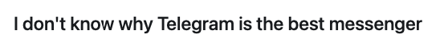
```html
<h4 id="anchor-text" class="">I don't know why Telegram is the best messenger</h4>
```

&nbsp;

##### Paragraph
*Input*
```json
{
  "type": "paragraph",
  "data": {
    "text": "Check out our projects on a <a href=\"https://github.com/codex-team\">GitHub page</a>.",
    "alignment": "center"
  }
}
```
*Output*

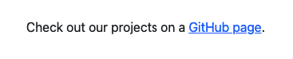
```html
<p class=" text-center">Check out our projects on a <a href="https://github.com/codex-team">GitHub page</a>.</p>
```

&nbsp;

##### Quote
*Input*
```json
{
  "type": "quote",
  "data": {
    "text": "The journey of a thousand miles begins with one step.",
    "caption": "Lao Tzu",
    "alignment": "center"
  }
}
```
*Output*


```html
<figure class=" text-center">
    <blockquote class="blockquote">
        The journey of a thousand miles begins with one step.
    </blockquote>
    <figcaption class="blockquote-footer">
        Lao Tzu
    </figcaption>
</figure>
```

&nbsp;

##### Warning
*Input*
```json
{
  "type": "warning",
  "data": {
    "title": "Note:",
    "message": "Avoid using this method just for lulz. It can be very dangerous opposite your daily fun stuff."
  }
}
```
*Output*

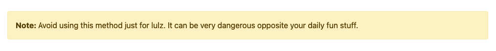
```html
<div class="alert alert-warning">
    <b>
        Note:
    </b>
    Avoid using this method just for lulz. It can be very dangerous opposite your daily fun stuff.
</div>
```

&nbsp;

##### Delimiter
*Input*
```json
{
  "type": "delimiter",
  "data": {}
}
```
*Output*


```html
<div class="alert alert-light text-center">***</div>
```

&nbsp;

##### Alert
*Input*
```json
{
  "type": "alert",
  "data": {
    "type": "primary",
    "message": "Something happened that you should know about."
  }
}
```
*Output*

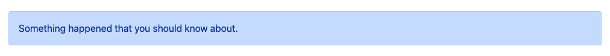
```html
<div class="alert alert-primary">
    Something happened that you should know about.
</div>
```

&nbsp;

##### List
*Input*
```json
{
  "type": "list",
  "data": {
    "style": "ordered",
    "items": [
      {
        "content": "Cars",
        "items": [
          {
            "content": "BMW",
            "items": [
              {
                "content": "Z3",
                "items": []
              },
              {
                "content": "Z4",
                "items": []
              }
            ]
          },
          {
            "content": "Audi",
            "items": [
              {
                "content": "A3",
                "items": []
              },
              {
                "content": "A1",
                "items": []
              }
            ]
          }
        ]
      },
      {
        "content": "Motorcycle",
        "items": [
          {
            "content": "Ducati",
            "items": [
              {
                "content": "916",
                "items": []
              }
            ]
          },
          {
            "content": "Yamanha",
            "items": [
              {
                "content": "DT 180",
                "items": []
              }
            ]
          },
          {
            "content": "Honda",
            "items": [
              {
                "content": "VFR 750R",
                "items": []
              }
            ]
          }
        ]
      }
    ]
  }
}
```
*Output*

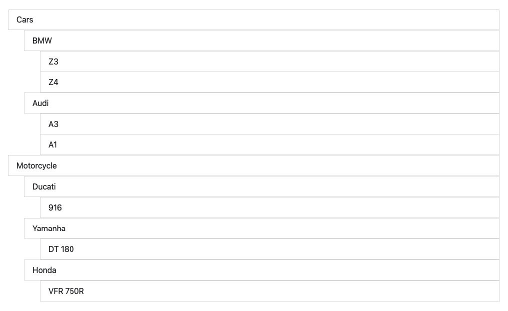
```html
<ol class="list-group">
    <li class="list-group-item">Cars</li>
    <ol class="">
        <li class="list-group-item">BMW</li>
        <ol class="">
            <li class="list-group-item">Z3</li>
            </li>
            <li class="list-group-item">Z4</li>
            </li>
        </ol>
        </li>
        <li class="list-group-item">Audi</li>
        <ol class="">
            <li class="list-group-item">A3</li>
            </li>
            <li class="list-group-item">A1</li>
            </li>
        </ol>
        </li>
    </ol>
    </li>
    <li class="list-group-item">Motorcycle</li>
    <ol class="">
        <li class="list-group-item">Ducati</li>
        <ol class="">
            <li class="list-group-item">916</li>
            </li>
        </ol>
        </li>
        <li class="list-group-item">Yamanha</li>
        <ol class="">
            <li class="list-group-item">DT 180</li>
            </li>
        </ol>
        </li>
        <li class="list-group-item">Honda</li>
        <ol class="">
            <li class="list-group-item">VFR 750R</li>
            </li>
        </ol>
        </li>
    </ol>
    </li>
</ol>
```

&nbsp;

##### Checklist
*Input*
```json
{
  "type": "checklist",
  "data": {
    "items": [
      {
        "text": "This is a block-styled editor",
        "checked": true
      },
      {
        "text": "Clean output data",
        "checked": false
      },
      {
        "text": "Simple and powerful API",
        "checked": true
      }
    ]
  }
}
```
*Output*

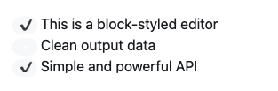
```html
<div class="">
    <div class="">
        <span class="badge rounded-pill bg-light">&#10004;</span>
        <span class="">This is a block-styled editor</span>
    </div>
    <div class="">
        <span class="badge rounded-pill bg-light">&nbsp;-&nbsp;</span>
        <span class="">Clean output data</span>
    </div>
    <div class="">
        <span class="badge rounded-pill bg-light">&#10004;</span>
        <span class="">Simple and powerful API</span>
    </div>
</div>
```

&nbsp;

##### Table
*Input*
```json
{
  "type" : "table",
  "data" : {
    "withHeadings": true,
    "content" : [ [ "Kine", "Pigs", "Chicken" ], [ "1 pcs", "3 pcs", "12 pcs" ], [ "100$", "200$", "150$" ] ]
  }
}
```
*Output*

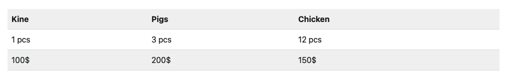
```html
<table class="table table-striped">
    <tr class="">
        <th class="">Kine</th>
        <th class="">Pigs</th>
        <th class="">Chicken</th>
    </tr>
    <tr class="">
        <td class="">1 pcs</td>
        <td class="">3 pcs</td>
        <td class="">12 pcs</td>
    </tr>
    <tr class="">
        <td class="">100$</td>
        <td class="">200$</td>
        <td class="">150$</td>
    </tr>
</table>
```

&nbsp;

##### AnyButton
*Input*
```json
{
  "type" : "AnyButton",
  "data" : {
    "link" : "https://editorjs.io/",
    "text" : "editorjs official"
  }
}
```
*Output*

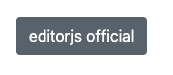
```html
<a class="btn btn-secondary" href="https://editorjs.io/">editorjs official</a>
```

&nbsp;

##### Code
*Input*
```json
{
  "type" : "code",
  "data" : {
    "code": "body {\n font-size: 14px;\n line-height: 16px;\n}",
    "languageCode": "css"
  }
}
```
*Output*

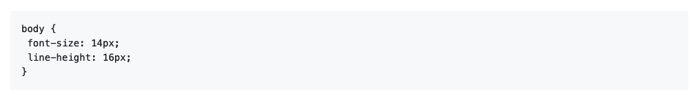
```html
<pre class="p-3 mb-2 bg-light">
    <code class="text-dark">
        body {
         font-size: 14px;
         line-height: 16px;
        }
    </code>
</pre>
```

&nbsp;

##### Raw
*Input*
```json
{
  "type" : "raw",
  "data" : {
    "html": "<div style=\"background: #000; color: #fff; font-size: 30px; padding: 50px;\">Any HTML code</div>"
  }
}
```
*Output*

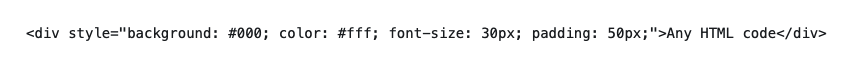
```html
<pre class="p-3 mb-2">
    <code class="text-dark">
        &lt;div style="background: #000; color: #fff; font-size: 30px; padding: 50px;"&gt;Any HTML code&lt;/div&gt;
    </code>
</pre>
```

&nbsp;

##### Image
*Input*
```json
{
  "type" : "image",
  "data" : {
    "file": {
      "url" : "https://images.freeimages.com/images/large-previews/2d8/mountains-1384887.jpg"
    },
    "caption" : "Mountain",
    "withBorder" : true,
    "withBackground" : true,
    "stretched" : true
  }
}
```
*Output*


```html
<div class="bg-warning p-5" >
    
</div>
```

&nbsp;

##### LinkTool
*Input*
```json
{
  "type" : "linkTool",
  "data" : {
    "link" : "https://codex.so",
    "meta" : {
      "title" : "CodeX Team",
      "site_name" : "CodeX",
      "description" : "Club of web-development, design and marketing. We build team learning how to build full-valued projects on the world market.",
      "image" : {
        "url" : "https://pbs.twimg.com/profile_images/993612654861344768/wMPEM5XW_400x400.jpg"
      }
    }
  }
}
```
*Output*

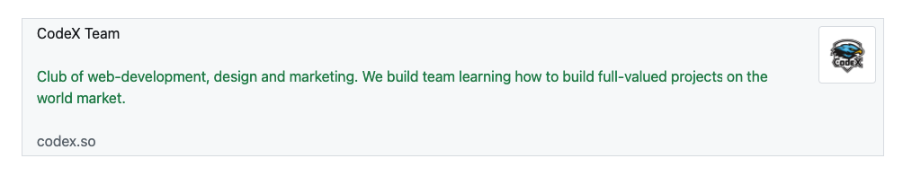
```html
<a href="https://codex.so" target="_Blank" rel="nofollow noindex noreferrer" class="text-decoration-none">
    <div class="container m-3 bg-light border">
        <div class="row">
            <div class="col-9 col-sm-10 col-md-11 d-grid gap-3">
                <div class="p-1 link-dark">
                    CodeX Team
                </div>
                <div class="p-1 link-success">
                    Club of web-development, design and marketing. We build team learning how to build full-valued projects on the world market.
                </div>
                <div class="p-1 link-secondary">
                    codex.so
                </div>
            </div>
            <div class="col-3 col-sm-2 col-md-1 p-2">
                
            </div>
        </div>
    </div>
</a>
```

&nbsp;

##### Attaches
*Input*
```json
{
  "type" : "attaches",
  "data" : {
    "file": {
      "url" : "https://www.tesla.com/tesla_theme/assets/img/_vehicle_redesign/roadster_and_semi/roadster/hero.jpg",
      "size": 260096,
      "name": "hero.jpg",
      "extension": "jpg"
    },
    "title": "Hero"
  }
}
```
*Output*

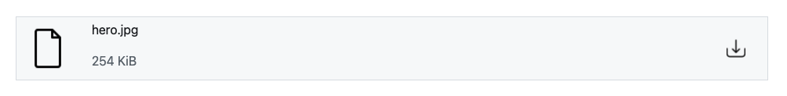
```html
<a href="https://www.tesla.com/tesla_theme/assets/img/_vehicle_redesign/roadster_and_semi/roadster/hero.jpg" rel="noopener noreferrer" target="_blank" class="text-decoration-none">
    <div class="container m-3 bg-light border">
        <div class="row" >
            <div class="col-3 col-sm-2 col-md-1 p-2" >
                
            </div>
            <div class="col-6 col-sm-8 col-md-10 d-grid">
                <div class="p-1 link-dark">
                    hero.jpg
                </div>
                <div class="p-1 link-secondary">
                    254 KiB
                </div>
            </div>
            <div class="col-3 col-sm-2 col-md-1 p-4" >
                
            </div>
        </div>
    </div>
</a>
```

&nbsp;

##### Embed
*Input*
```json
{
  "type" : "embed",
  "data" : {
    "service" : "Youtube",
    "source" : "https://www.youtube.com/watch?v=viW44cUfxCE",
    "embed" : "https://www.youtube.com/embed/viW44cUfxCE",
    "width" : 560,
    "height" : 315,
    "caption" : "Lamborghini Aventador SVJ"
  }
}
```
*Output*

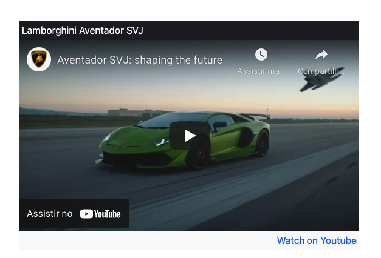
```html
<div class="d-grid m-5" style="max-width: 560px">
    <div class="bg-dark p-1 text-light">Lamborghini Aventador SVJ</div>
    <iframe width="560" height="315" src="https://www.youtube.com/embed/viW44cUfxCE" title="Lamborghini Aventador SVJ" frameborder="0" allow="accelerometer; autoplay; clipboard-write; encrypted-media; gyroscope; picture-in-picture" allowfullscreen></iframe>
    <div class="d-grid justify-content-md-end bg-light p-1">
        <a class="text-decoration-none" href="https://www.youtube.com/watch?v=viW44cUfxCE" target="_Blank">Watch on Youtube</a>
    </div>
</div>
```

&nbsp;

##### ImageGallery
*Input*
```json
{
  "type": "imageGallery",
  "data": {
    "urls": [
      "https://www.nawpic.com/media/2020/ocean-nawpic-15.jpg",
      "https://www.nawpic.com/media/2020/ocean-nawpic-18.jpg",
      "https://wallpapercave.com/wp/6L4TVMP.jpg",
      "https://wallpapercave.com/wp/wp9810772.jpg",
      "https://wallpapercave.com/wp/wp9121482.jpg",
      "https://wallpapercave.com/wp/wp9100484.jpg",
      "https://cdn.wallpapersafari.com/94/22/4H3mFp.jpg"
    ],
    "editImages": true,
    "bkgMode": false,
    "layoutDefault": true,
    "layoutHorizontal": false,
    "layoutSquare": false,
    "layoutWithGap": false,
    "layoutWithFixedSize": false
  }
}
```
*Output*


```html
<div class="gg-container">
    <div class="gg-box" id="">
        
        
        
        
        
        
        
    </div>
</div>
```
